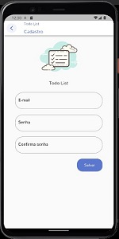
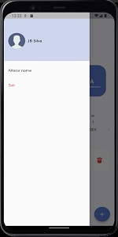
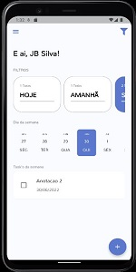

# todo_list_provider

<br>
<br>
<br>







# Todo-List

## Aplicativo para anotações de compromissos (tasks)

### Arquitetura

>Core

- É a pasta onde ontem o alicerce da aplicação, todas as pastas e seus arquivos podem ser acessados de qualquer lugar.

>Exception

- É a pasta onde ira conter todas as exceções que podem acontecer na aplicação

>Models

- É a pasta de modelos, conceito de objeto, trás a estrutura de um objeto real

>Modules

- É a pasta de futures da aplicação, são as funcionalidades dentro do sistema

>Services

- É a pasta de serviços, regras de negocio do sistema, onde implementa condições para determinada ação.

>Repositories

- É a pasta de camada de dados, informações diversas do sistema, vindas de <i>n</i> lugares

# MVVM

## Views

- Pagina: Conteudo exibida ao usuario
- Pagina Controller: Faz a gestao do conteudo exibido, se comunida com os serviços e repositorios e passa valores para a Pagina

## Core

- Arquivos e pastas que sao comuns em toda aplicação, os dados pastas e arquivoss neste local sao os que podem ser acessados por qualquer outro arquivo em qualquer local da aplicacao

## Exception

- Pasta onde sera armazenada as excessoes da aplicação para msg personalizadas, é uma classe que implementa ```Exception```

## Models

- Pasta para arquivos de estruitura de dados como objeto do mundo real (Dart OO)

## Modules

- Pasta de funcionalidades do sistema, as views e widgets personalizados com seus controladores ficam nesta pasta.

## Services

- Pasta que contem arquivos de controle da aplicação, regras e condições para acessar algum dado ou retornar algum valor, regras de negocios no geral, classes abstratas e suas implementações

## Repositories

- Pasta que contem as camadas de dados do aplicativo, possui os mesmo tipos de arquivos dos services, porem as funcionalidades sao diretas, sem regras, pois as regras para acessar as funcoes nela contida devem vim de services, esta pasta contem arquivos que vao buscar informações num BD ou um autenticador, busca dados externos

***
***

## Sobre o APP

- Main/runApp: 

>Executa o app chamando o AppModule
***

- AppModule:

>Classe principal do app, onde ira receber as estruturas no caso multiprovider, em seu child é passado o AppWidget que recebe toda configuração do Provider de seu pai.
***
>Na lista de providers foram passados

- Provider onde seu create é uma funcao sem parametros que retorna um SqliteConnectionFactory, criando assim uma conexao com bd para todo o app, em sem lazy passa o valor de false pois a conexao com o BD sera feita assim que invocada a funcao, na abertura do aplicativo

***

- AppWidget:

>Widget view principal que retorna o MaterialApp

- title : titulo do app
- home: pagina inicial do app SplashPage()
- routers:

***
>Criado na classe o initState que executa acoes quando a aplicação é inicializada

- WidgetsBinding.instance.addObserver que recebe o sqliteAdmConnection, assim verificando estado da conexao ao abrir o app

***
>Criado na classe o dispose que executa acoes ao fechar o app

- WidgetsBinding.instance.removeObserver para a verificacao de estado ao fechar o app

***

- SplashPage:

> Pagina estática que so aparece o logo do app e redireciona para outra


